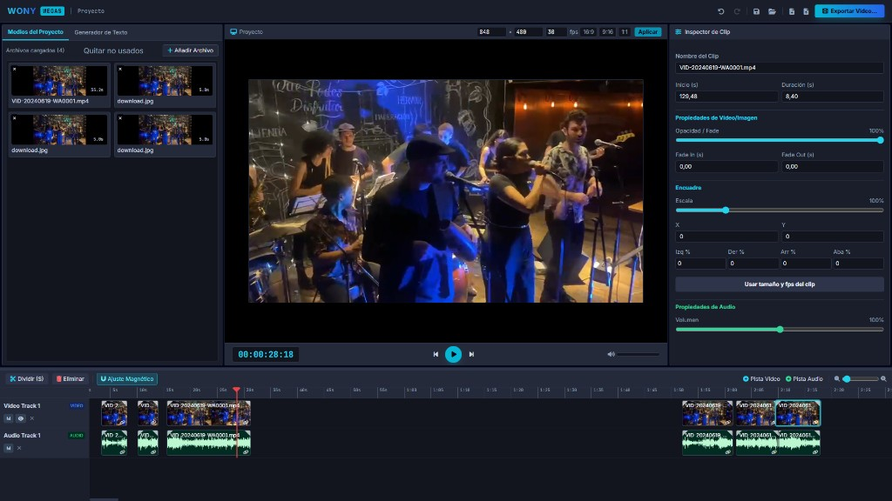

# Wony Wegas

A super easy video editor that runs in the browser. No install, no account, and no backend. Your files stay on your computer.



## Open it

[https://brotochola.github.io/wony_wegas/](https://brotochola.github.io/wony_wegas/)

To run this folder yourself, serve it with any static file server and open `index.html`. From this folder:

```
npx --yes serve .
```

Opening the file directly (`file://`) will not load the editor. The scripts are modules, and browsers block those from a local file.

## Edit

1. Drop a video, audio file, or image into **Project Media**, or click **Add File**.
2. Drag it onto the timeline. Double-click a file to add it at the end.
3. Trim the edges, split at the playhead, and move clips. Linked audio stays with the picture until you unlink it.
4. Press **Space** to play. Select a clip and use the inspector for size, crop, fades, and volume.
5. Click **Export Video** when it looks right. Chrome writes an MP4 when WebCodecs is available, and falls back to WebM otherwise.

Press `?` for the shortcut list.

## Save

The floppy-disk icon saves the edit on this computer. The download icon saves the same edit as a JSON file you can move. Neither one copies the media. When you open the project again, point it at the same files. In Chrome, a saved permission can reopen them without copying.

## What you can do

- Video, audio, and image clips, plus text
- Several video and audio tracks
- Trim, split, ripple delete, duplicate, copy, and paste
- Snap, fades, opacity, volume, scale, position, and crop
- Undo and redo
- In and out points for the export range
- 16:9, 9:16, and 1:1, or your own size and frame rate

A current desktop browser is enough. Chrome is the one that can remember file permission and export MP4.
